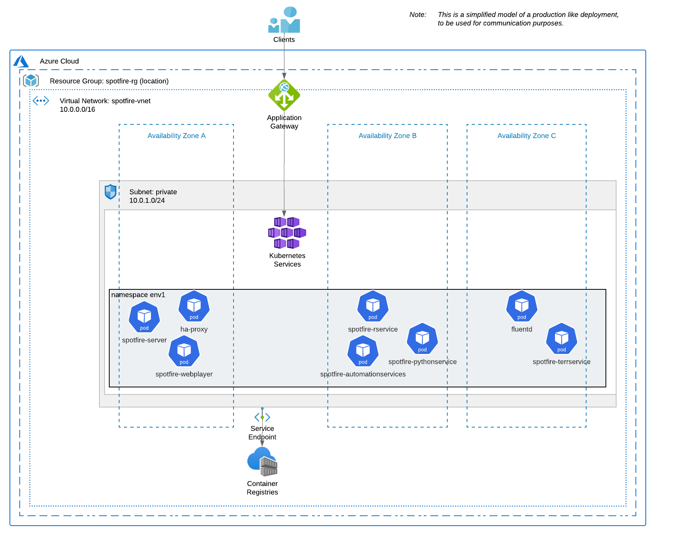

# Spotfire Quickstart on Azure Kubernetes Service (AKS)

## Overview

This **Spotfire QuickStart on Azure AKS** shows how to automatically deploy the [Spotfire platform](https://www.spotfire.com/) on [Azure Kubernetes Service (AKS)](https://azure.microsoft.com/en-us/products/kubernetes-service) using container images and Helm charts.

**Note**: The purpose of this quickstart example is to provide a starting point for automatic deployment of Spotfire.
This quickstart is not for production usage.
This quickstart example can be easily extended and customized for production usage.

**Note**: This quickstart example has been verified with Spotfire 14.0 release, but it may work for other Spotfire versions with minimal modifications.

### Which kind of Spotfire environment is deployed by this quickstart example?

This quickstart has 2 main parts:

1. Create the required infrastructure components using [Terraform](https://www.terraform.io/) templates:
   - Virtual Private Cloud: Azure Virtual Network.
   - Kubernetes cluster: Azure Kubernetes Service (AKS).
   - OCI registry: Azure Container Registry (ACR).
   - Load balancer: Azure Application Gateway (optional).

2. Deploy the Spotfire environment using the [Spotfire Cloud Deployment Kit (CDK)](https://github.com/spotfiresoftware/spotfire-cloud-deployment-kit/tree/main) in the created infrastructure:
   - All typical services in a Spotfire platform environment, using the Spotfire container images and Helm charts

The following diagram shows the deployed environment by this **Quickstart for Spotfire on AKS**:



**Note**: This quickstart uses the [Spotfire Cloud Deployment Kit](https://github.com/spotfiresoftware/spotfire-cloud-deployment-kit/tree/main) to build and deploy the Spotfire container images and Helm charts.
For more information, see the project's documentation and examples.

**Note**: This quickstart has been customized and extended from the tutorial: [Provision an AKS Cluster (Azure)](https://learn.hashicorp.com/terraform/kubernetes/provision-aks-cluster).
For more information and extending the example, see the [Terraform Azure provider documentation](https://registry.terraform.io/providers/hashicorp/azurerm/latest).

## Prerequisites

- Required **Spotfire** installation packages. You can download them from the [Spotfire Download site](https://www.spotfire.com/downloads).
- A **Linux host** with admin permissions to install and use the tools.
    You can use a bare metal installed server, a virtual machine, or WSL on Windows.
    In this quickstart we will refer to it as "_the launcher_".
- You have the following installed command tools in your launcher: `make`, `terraform`, `docker`, `kubectl`, `helm`, `jq`.
- You have installed the Azure CLI.
- A valid **Azure account and access credentials**.

**Note**: All the examples and scripts in this quickstart use a Debian/Ubuntu host as the launcher, but you can use any Linux distro.
See the corresponding vendor instructions and adapt the quickstart as required for using other operating systems.

## Launcher setup

1. Clone this repo into a folder in your launcher host:
    ```bash
    git clone https://github.com/spotfiresoftware/spotfire-quickstart
    ```

2. Download the Spotfire software and copy the files into `<this_repo_root>/swrepo/build/<spotfire_version>`.

   **Note**: See the [Spotfire software repository](../../swrepo/build/README.md) for more information.

## Usage

The deployment life cycle consists of these main steps:

- Install requirements
- Configure your cloud account and the target infrastructure sizing
- Create the required infrastructure (with Terraform)
- Deploy Spotfire on the created cluster
- (Optional) Prepare the container registry
- Destroy the created infrastructure

For easier setup we provide a `Makefile` with commands for the  common steps.
You can read the `Makefile` for more info on the specific commands.

### Install requirements

First, you need to install `terraform`, `ansible` and the Azure CLI in your launcher.

For a quick reference, see [Install the applications](../../terraform/azure/docs/Setup.md).

### Configure your cloud account and the target infrastructure sizing

**Note**: The specific method to access your cloud account and roles might change depending on your company policy.
Make sure you understand how identity management works in Azure.
The steps below are an example:

1. Log in to Azure:
    ```bash
    make az-login
    ```
   **Note**: This make command wraps a call to `az login --use-device-code`.
   For more details or other authentication methods, see [Sign in with Azure CLI](https://learn.microsoft.com/en-us/cli/azure/authenticate-azure-cli).

2. You need to create an Azure Service Principal (only once). 
    You can use the provided script: `./az_create_sp.sh`

3. Now, authenticate with your service principal:
    ```bash
    make az-sp-login
    ```

4. Copy the provided example `terraform.tfvars.example` to a new file, for example `terraform.tfvars`.
   Read and modify as needed the deployment configuration variables in the `terraform.tfvars` file.
   Read the file `variables.tf` and the other template files (`*.tf`) for more variables and usage.
   Remember that you can (and should) modify the templates included in this quickstart to adapt them to your needs.

### Create the required infrastructure (using Terraform)

1. Init your Terraform workspace (fetch/update Terraform plugins and modules):
    ```bash
    make init
    ```

2. Plan (preview the changes Terraform will make before you apply):
    ```bash
    make plan
    ```

3. Apply (makes the changes defined by your plan to create, update, or destroy resources):
    ```bash
    make apply
    ```
   **Note**: The Terraform deployment takes around 10 min.
   Note that the resources may take some more minutes to be ready.

4. Add the created K8s configuration to your kubectl config:
    ```bash
    make az-aks-cfg-kubectl
    ```

5. Show the created K8s cluster configuration:
    ```bash
    make az-aks-show
    ```

### Optional: Prepare the container registry

Follow these steps if you want to use the Spotfire CDK to build the images and need a container registry to host these images.
Otherwise, if you have access to a registry with the prebuilt Spotfire images, jump to the next header.

1. Log in to the created Azure Container Registry (ACR) to be able to push images:
    ```bash
    make az-acr-login
    ```

2. Show the created registry:
    ```bash
    make az-acr-show
    ```

3. Set the `REGISTRY_SERVER` variable in your environment as indicated from the previous output.
   For example:
    ```bash
    export REGISTRY_SERVER=spotfirequickstart.azurecr.io
    ```

### Deploy Spotfire on the created cluster

Now you must choose between:

A. To build the Spotfire images and charts, follow the steps in [Deploy Spotfire on a Kubernetes cluster using the Spotfire CDK](../../spotfire-cdk-quickstart/README.md).

   Change to the directory and follow the `README.md` steps:
    ```bash
    cd ../../spotfire-cdk-quickstart
    ```

B. To use the pre-built Spotfire images and charts, follow the steps in [Deploy Spotfire on a Kubernetes cluster using pre-built Spotfire images and Helm charts](../../spotfire-sok-quickstart/README.md).

   Change to the directory and follow the `README.md` steps:
    ```bash
    cd ../../spotfire-sok-quickstart
    ```

   **Note**: To understand the differences between both options, see [Spotfire on Kubernetes](https://spotfi.re/sok).

### Destroy the created infrastructure

When you are done, remember to destroy the created resources to avoid unneeded costs.
```bash
make destroy
```

### Other

See other useful commands included in the provided `Makefile`:
```bash
make
```

## What to do next

There are further ways to customize this quickstart:

- Enable SSL connections
- Add external user authorization and authentication
- Use Azure SQL as the Spotfire database
- Add Azure Object storage for the Spotfire library items storage
- Add a Spotfire action log database
- Use multiple regions
- etc.

Please, see the [Spotfire® Server and Environment - Installation and Administration](https://docs.tibco.com/pub/spotfire_server/latest/doc/html/TIB_sfire_server_tsas_admin_help/server/topics/basic_installation_process_for_spotfire.html) documentation for details on specific Spotfire administration and configuration procedures.
