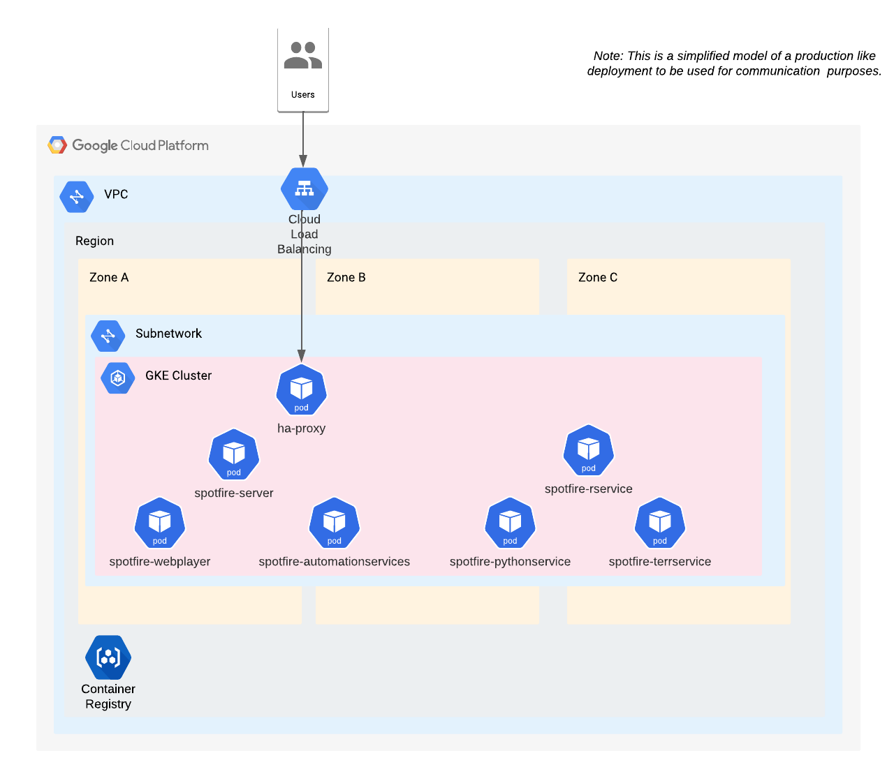

# Automatic Deployment of Spotfire Platform on Google Kubernetes Engine (GKE) using Spotfire containers images and Helm charts

## Overview

This **Spotfire QuickStart in Google GKE** shows how to automatically deploy the [Spotfire platform](https://www.spotfire.com/) on Google Kubernetes Engine (GKE) using container images and Helm charts.

**Note**: The purpose of this quickstart example is to provide a starting point for automatic deployment of Spotfire. This quickstart is not for production usage. This quickstart example can be easily extended and customized for production usage.

**Note**: This quickstart example has been verified with Spotfire 12.5 release, but it may work for other Spotfire versions with minimal modifications.

### Which kind of Spotfire environment is deployed by this quickstart example?

This quickstart has 2 main parts:

1. Deploy the required infrastructure components (using Terraform templates):
   - Virtual Private Cloud: Google Cloud VPC.
   - Kubernetes cluster: Google Kubernetes Engine (GKE).
   - OCI registry: Google Cloud Artifact Registry.
   - Load balancer: Google Cloud Load Balancing (optional).

2. Deploy the Spotfire environment (using the Spotfire CDK) in the created infrastructure:
   - All typical services in a Spotfire platform environment, using the Spotfire container images and Helm charts

The following diagram shows the deployed environment by this **Quickstart for Spotfire in GKE**:



**Note**: This quickstart uses the [Spotfire Cloud Deployment Kit](https://github.com/spotfiresoftware/spotfire-cloud-deployment-kit/tree/main) to build and deploy the Spotfire container images and Helm charts.
For more information, see the project's documentation and examples.

**Note**: This quickstart has been customized and extended from [Provision a GKE Cluster learn guide](https://learn.hashicorp.com/terraform/kubernetes/provision-gke-cluster).
For more information and extending the example, see [https://registry.terraform.io/providers/hashicorp/google/latest].

## Prerequisites

- Required **Spotfire** installation packages.
- A **Linux host** with admin permissions to build and execute the containers.
    You can use a bare metal installed server, a virtual machine, or WSL on Windows.
    In this quickstart we will refer to it as "_the launcher_".
    All the examples are using an Ubuntu server.
- You have the following installed command tools in your launcher: `make`, `terraform`, `docker`, `kubectl`, `helm`, `jq`.
- You have installed Google CLI.
- A valid **GCP account and access credentials**.

## Usage

### Get your current Google Cloud projects

From the gcloud cli:
```bash
gcloud config get-value project
```
From the Google Cloud management web UI:
https://console.cloud.google.com/home/dashboard?project=my-project-id

### Deploy a GKE cluster in GCP

For easier setup we provide a `Makefile` with commands for the  common steps.
You can read the `Makefile` for more info on the specific commands.

Steps:

1. Log in to GCP:
    ```bash
    make gcp-login
    ```
    **Note**: This make command wraps a call to `gcloud auth application-default login`.
    For more details or other authentication methods, see [Google Cloud Authentication methods](https://cloud.google.com/container-registry/docs/advanced-authentication).

2. Copy the provided example `terraform.tfvars.example` to a new file, for example `terraform.tfvars`.
    Read and modify as needed the deployment configuration variables in the `terraform.tfvars` file.
    Read the file `variables.tf` and the other template files (`*.tf`) for more variables and usage.
    Remember that you can (and should) modify the templates included in this quickstart to adapt them to your needs.

3. Init your Terraform workspace (fetch/update Terraform plugins and modules):
    ```bash
    make init
    ```

4. Plan (preview the changes Terraform will make before you apply):
    ```bash
    make plan
    ```

5. Apply (makes the changes defined by your plan to create, update, or destroy resources):
    ```bash
    make apply
    ```
   **Note**: The Terraform deployment takes around 10 min.
   Note that the resources may take some more minutes to be ready.

6. Add the GKE configuration to your kubectl config:
    ```bash
    make gcp-gke-cfg-kubectl
    ```

7. Show the created K8s cluster configuration:
    ```bash
    make gcp-gke-show
    ```

8. Enable required GCP service APIs and log in to the created Google Artifact Registry to be able to push images:
    ```bash
    make gcp-enable-apis
    make gcp-gke-login
    ```

9. Set REGISTRY variable to point to the created registry:
    ```bash
    make gcp-registry-show
    ```
   Set the REGISTRY variable in your environment as indicated from the previous output.
   For example:
    ```bash
    export REGISTRY=europe-north1-docker.pkg.dev/my-project-id/spotfire-quickstart
    ```

### Deploy Spotfire in the created GKE cluster

Now we use the Spotfire CDK to build the Spotfire container images and Helm charts and deploy Spotfire in the created K8s cluster.

1. Change to the directory:
    ```bash
    cd ../spotfire-cdk-quickstart
    ```

2. Follow the steps in [Deploy Spotfire on a kubernetes cluster using the Spotfire CDK](../spotfire-cdk-quickstart/README.md).

### Setup K8s dashboard in GKE (optional)

1. Deploy and access k8s dashboard:
    ```bash
    make k8s-deploy-dashboard
    ```
   Kubectl will make the K8s Dashboard available at http://localhost:8001/api/v1/namespaces/kubernetes-dashboard/services/https:kubernetes-dashboard:/proxy/.
   **Note**: For more information, see https://kubernetes.io/docs/tasks/access-application-cluster/web-ui-dashboard/

2. Create the ClusterRoleBinding resource and generate the authorization token to access the k8s dashboard:
    ```bash
    make k8s-get-token
    ```
   
3. Login into your k8s dashboard [here](http://127.0.0.1:8001/api/v1/namespaces/kubernetes-dashboard/services/https:kubernetes-dashboard:/proxy/).
 
4. Show your cluster info:
    ```bash
    make k8s-info
    ```

### Clean up

When you are done, remember to destroy the created resources to avoid unneeded costs.
```bash
make destroy
```

### Other

See other useful commands included in the provided 'Makefile':
```bash
make
```

## What to do next

There are further ways to customize this quickstart:

- Enable SSL connections
- Add external user authorization and authentication
- Use Google SQL as the Spotfire database
- Add a Spotfire action log database
- Use multiple regions
- etc.

Please, see the [Spotfire® Server and Environment - Installation and Administration](https://docs.tibco.com/pub/spotfire_server/latest/doc/html/TIB_sfire_server_tsas_admin_help/server/topics/getting_started.html) documentation for details on specific Spotfire administration and configuration procedures.
