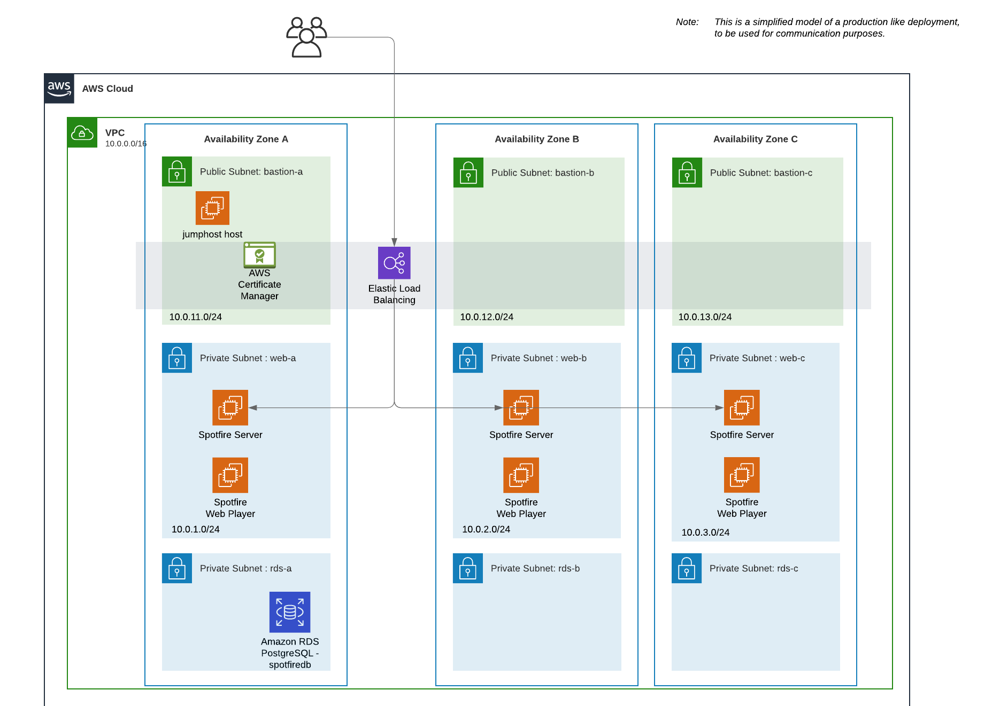

# Automatic Deployment of Spotfire Platform on AWS using Terraform + Ansible

## Overview

This **Spotfire QuickStart** example shows how to automatically deploy the Spotfire Platform on AWS
using the 2 of the most commonly used agnostic configuration management tools:
- [Terraform](https://www.terraform.io/).
- [Ansible](https://github.com/ansible/ansible).

**Note**: The purpose of this quickstart example is to provide a starting point for automatic deployment of Spotfire.
This quickstart is not for product usage.
This quickstart example can be easily extended and customized for production usage.

**Note**: This quickstart example has been verified with Spotfire 12.0.0+ series, but it may work for other Spotfire versions with minimal modifications.

### Which kind of Spotfire deployment is deployed by this quickstart example?

This example follows the [Basic installation process for Spotfire](https://docs.tibco.com/pub/spotfire_server/latest/doc/html/TIB_sfire_server_tsas_admin_help/server/topics/basic_installation_process_for_spotfire.html)
from the [TIBCO Spotfire® Server and Environment - Installation and Administration](https://docs.tibco.com/pub/spotfire_server/latest/doc/html/TIB_sfire_server_tsas_admin_help/server/topics/getting_started.html).

This basic installation will deploy the following components:
- Virtual Private Cloud (AWS VPC) and subnetworks.
- Jump-host server VMs for administration of the TIBCO Spotfire VMs.
- TIBCO Spotfire Server VMs (using AWS EC2 Linux Virtual Machine instances).
- TIBCO Spotfire Web Player VMs (using AWS EC2 Windows Virtual Machine instances).
- TIBCO Spotfire database (using AWS RDS for PostgreSQL).
- Load balancer (using AWS Load Balancer) (optional).

**Note**: This deployment has been verified with AWS EC2 Linux Virtual Machine instances with Debian 11.

The following diagram shows the deployed environment by this _Quickstart for TIBCO Spotfire in AWS_.



## Prerequisites

- Required **TIBCO Spotfire** installation packages. You can download them from [TIBCO eDelivery](https://edelivery.tibco.com/storefront/index.ep):
    - TIBCO Spotfire Server: Linux tar.gz package:
        - `tss-<version>.x86_64.tar.gz`
    - TIBCO Spotfire node manager: Linux tar.gz package:
        - `tsnm-<version>.x86_64.tar.gz`
    - TIBCO Spotfire distribution files (the distribution files can contain packages for clients, services or customizations):
        - `Spotfire.Dxp.sdn`
        - `Spotfire.Dxp.netcore-linux.sdn`
- A **Linux host** with admin permissions to build and execute the containers.
  You can use a bare metal installed server, a virtual machine, or WSL on Windows.
  In this quickstart we will refer to it as "_the launcher_".
  All the examples are using an Ubuntu server.
- A valid **AWS account and credentials**.

**Note**: In this example we use a Debian/Ubuntu host to run Terraform and Ansible, but you can use any Linux distro.
See the corresponding vendor instructions for using other operating systems.

## Launcher setup

1. Clone this repo into a folder in your launcher host:
    ```bash
    git clone https://got-gitlab01.emea.tibco.com/mdiez/sandbox/
    ```

2. Download the Spotfire software and copy the files into `<this_repo_root>/swrepo/build`:
    - `tss-<version>.x86_64.tar.gz`
    - `tsnm-<version>.x86_64.tar.gz`
    - `Spotfire.Dxp.sdn`
    - `Spotfire.Dxp.netcore-linux.sdn`
    - `scripts/`

    **Note**: See the [Spotfire software repository](../../swrepo/build/README.md) for more information.

3. You need to install the required configuration management applications.

   For using the configuration management applications from a bare-metal server, VM or WSL, 
   follow the [Install the Configuration Management applications](docs/Setup.md) instructions to manually install and configure GCP CLI, Terraform and Ansible in your launcher.

   For your convenience, there is a `Makefile` that enables you to use Terraform and Ansible commands via the `make` command from the Terraform templates folder (`<this_repo_root>/terraform/aws`).
   This way, you do not need to memorize the syntax, and the commands are much simpler.

   **Note**: You can create an alias to execute `make` from any directory:
    ```bash
    cd <this_repo_root>/terraform/gcp
    alias tsa="make --directory $PWD"
    ```

   **Note**: If you want to know about the details and understand what is going under the hood,
   you can check the [Detailed instructions](docs/Detailed-instructions.md).

4. Generate SSH keys (if you do not have them already):
    ```bash
    ssh-keygen -t rsa -C "spotfire-deploy-aws" -f ~/.ssh/id_rsa_aws -N ""
    ```

## Usage

The deployment life cycle consists of these steps:

- Prepare your launcher host
- Configure the target environment
- Create the required infrastructure (with Terraform)
- Deploy the Spotfire software (with Ansible)
- Resize or reconfigure the created environment
- Destroy the created environment

### Prepare your launcher host

1. Initiate your environment (it installs and upgrades required Terraform modules):
    ```bash
    make init
    ```

2. If not already done, configure the credentials for the AWS CLI:
    ```bash
    make aws-assume-role-env
    ```
    **Note**: For more details, see [Install the applications](docs/Setup.md).

    **Note**: The token expires in some minutes-hours depending on your AWS account configuration. 
    In that case, apply again.

### Configure the target environment

3. You can customize the **deployment environment** by editing the file `terraform.env`.

   **Note**: You need to use a different `TF_WORKSPACE` for applying different environments for the same location.

4. You can customize the **infrastructure settings** like number of instances or sizing, by modifying the `terraform.env`, `variables.tfvars` and `vars-size-XS.tfvars`.
   Open the files for listing the existing configuration variables, description and documentation links.

   **Note**: You need to use a different `prefix` in `variables.tfvars` for applying multiple environments using the same account.

   **Note**: You need to modify the `admin_address_prefixes` and `web_address_prefixes` variables,
   so you allow infra admin and end user access to the environment from your respective selected address blocks
   (you can find your public ip address for example in https://whatismyipaddress.com/).

   **Note**: We may decide to not create an AWS Load Balancer,
   since it takes some time, money, and it may not be very interesting for very small test environments (like 1tss+1tswp).
   Check in `vars-size-XS.tfvars` the variables that control *resource creation and sizing*.

   **Note**: If you choose to not creating an AWS Load Balancer, you need to choose to create public ip addresses for your tss hosts.

   **Note**: The `vars-size-XS.tfvars` settings overrides `variables.tfvars` settings.

5. If you want to change **Spotfire application settings** (like the Spotfire version, config-tool and web admin credentials,...), review and edit the file `ansible/config/vars.yml`.

   **Note**: The variables in `ansible/config/vars.yml` are used as defaults and may be overriden by previous configuration files.

### Create the required infrastructure (Terraform)

6. Verify the planed infrastructure changes before applying them:
    ```bash
    make plan
    ```

7. If you agree with the planned changes, apply them to create the infrastructure:
    ```bash
    make apply
    ```
   **Note**: This step may take 15-30 minutes depending on the sizing:

### Deploy the Spotfire software (Ansible)

8. Once the infrastructure is in place, you can deploy the software:
    ```bash
    make deploy
    ```

### Resize or reconfigure the created environment

9. You can resize or change your system's configuration by editing again the named configuration files and repeating steps 4-8_:
    ```bash
    make plan
    make apply
    make deploy
    ```

    **Note**: You can use similar deploy command as previous to limit the deployment to a specific type of server.
    For example if you only increased the number of VM instances for the Web Player servers you can just deploy those with:
    ```bash
    make deploy ANSIBLE_EXTRA_ARGS="--limit wp_servers"
    ```

### Destroy the created environment

10. Remember to destroy the environment when you are not going to use it to avoid unneeded costs:
    ```bash
    make destroy
    ```

    **Note**: You may need to execute this command a couple of times to destroy all the resources.
    This sometimes happens if the resources is being access.

## Use your environment

1. You can find details for the created environment using:
    ```bash
    make show-hosts
    make show-lb
    ```

   There are more `show-*` command aliases preconfigured to retrieve basic information on your system.
   Run `tsa` without arguments to see the command help.

2. Open the TIBCO Spotfire server web UI:
    - If you chose to create public ip addresses for you tss server(s), you can connect to the tss using `http://<your-tss-ip-address>`.
    - If you chose to create an AWS Load Balancer, you can connect to the tss cluster using `http://<your-aws-elb-ip-address>`.

## What to do next

There are further ways to customize this quickstart:

- Enable SSL connections
- Add other Spotfire services
- Add external user authorization and authentication
- Add a Spotfire action log database
- Add AWS S3 object storage for the Spotfire library items storage
- Use multiple AWS regions
- etc.

Please, see the [TIBCO Spotfire® Server and Environment - Installation and Administration](https://docs.tibco.com/pub/spotfire_server/latest/doc/html/TIB_sfire_server_tsas_admin_help/server/topics/getting_started.html) documentation for details on specific administration procedures.
