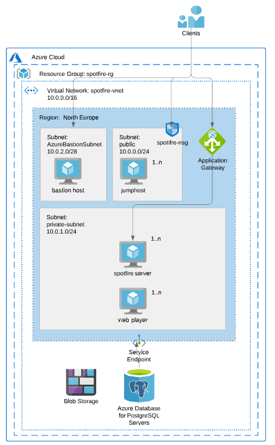

# Automatic Deployment of Spotfire Platform on Azure using Terraform + Ansible

## Overview

This **Spotfire QuickStart** example shows how to automatically deploy the Spotfire Platform on Azure using the 2 most used agnostic configuration management tools: [Terraform](https://www.terraform.io/) and [Ansible](https://github.com/ansible/ansible) .

Note: The purpose of this quickstart example is to provide a starting point for automatic deployment of Spotfire in any environment. This quickstart example can be easily extended and customized.

Note: This quickstart example has been verified with Spotfire 11.x series, but it may work for previous Spotfire versions with minimal modifications.

### Which kind of Spotfire deployment is deployed by this quickstart example?

This example follows the [Basic installation process for Spotfire
](https://docs.tibco.com/pub/spotfire_server/latest/doc/html/TIB_sfire_server_tsas_admin_help/server/topics/basic_installation_process_for_spotfire.html) from the [TIBCO Spotfire® Server and Environment - Installation and Administration](https://docs.tibco.com/pub/spotfire_server/latest/doc/html/TIB_sfire_server_tsas_admin_help/server/topics/getting_started.html).

This basic installation will deploy the following components:
- TIBCO Spotfire Server(s) (using Azure Linux virtual machine(s))
- TIBCO Spotfire Web Player(s) (using Azure Windows Linux virtual machine(s))
- TIBCO Spotfire database (using Azure Database for PostgreSQL)
- Load balancer (using Azure Application Gateway) (optional)
- Azure Bastion host to manage Windows servers (optional)

The diagram shows the Spotfire architecture in Azure.



## Prerequisites

1. You need to **download the TIBCO Spotfire software** (available from [TIBCO eDelivery](https://edelivery.tibco.com/storefront/index.ep)).
    - TIBCO Spotfire Server: Linux rpm package (`tss-<version>.rpm`)
    - TIBCO Spotfire node manager: Windows installation package (`nm-setup.exe`)
    - TIBCO Spotfire Server client packages: Distribution package (`Spotfire.Dxp.sdn`)
    - TIBCO Spotfire database scripts 
    
2. You need a **Debian/Ubuntu host** with admin permissions to execute the automatic deployment. You can use a bare metal installed server, a virtual machine or WSL on Windows. Let's call it "the launcher".

3. Valid **Azure credentials**.

Note: In this example we use a Debian/Ubuntu host to run Terraform and Ansible, but you can use any Linux distro. See the corresponding vendor instructions for using other operating systems.

## Setup

1. Clone this repo into a folder in your launcher.

   ```
   git clone https://github.com/<location>/spotfire-quickstart
   ```

2. Download the Spotfire software and copy the files into `<this_repo_root>/swrepo/build`

   - tss-<version>.x86_64.rpm
   - nm-setup.exe
   - Spotfire.Dxp.sdn
   - scripts/

3. You need to install the required configuration management applications. You can either:

   a) Follow the [Install the Configuration Management applications](docs/Setup.md) instructions to manually install and configure Azure CLI, Terraform and Ansible in your launcher.

   b) Follow the [Build spotfire-autodeploy container](../../autodeploy/dockers/spotfire-autodeploy-buster-slim/README.md) instructions to build an "all-in-one" container including Azure CLI, Terraform and Ansible configuration management applications.

4. Generate SSH keys (if you do not have them already).

   ```
   ssh-keygen -t rsa -C "spotfire-deploy" -f ~/.ssh/id_rsa -N ""
   ```

## Usage

The deployment life cycle consists of 5 steps:

1. Prepare your launcher server
2. Configure your deployment
3. Review planned changes 
4. Create required infrastructure (with Terraform)
5. Deploy Spotfire software (with Ansible)
6. Destroy the environment

### Detailed instructions

If you want to know about the details and understand what is going under the hood, you can follow the [Detailed instructions](docs/Detailed-instructions.md). Otherwise, continue with the "Easy peasy instructions" chapter.

### Easy peasy instructions

If you chose to follow the instructions to [build spotfire-autodeploy container](../../autodeploy/dockers/spotfire-autodeploy-buster-slim/README.md) in your launcher you can jump over and start with the first step "*Prepare the environment*".

If you chose to follow the instructions to [install the Configuration Management applications](docs/Setup.md) in your launcher, for your convenience, there is a `Makefile` that enables you to use Terraform and Ansible commands via the `make` command from the Terraform templates location (`<this_repo_root>/terraform/azure`). This way, you do not need to memorize the syntax and the commands are much simpler. For simplicity, you can create an alias.

```
cd <this_repo_root>/terraform/azure
alias tsa="make --directory $PWD"
```

#### Prepare your launcher server

1. Initiate your environment (only required the first time).

   ~~~
   tsa init
   ~~~

2. If not already done, sign in into Azure with the Azure cli. See the Azure CLI instructions within [Install the applications](docs/Setup.md) for more details.

   ~~~
   tsa azlogin
   ~~~

#### Configure the environment

1. You can customize the **deployment environment** by editing the file `terraform.env`.

   Note: You need to use a different `TF_WORKSPACE` in `terraform.env` for applying different environments for the same repo.

2. You can customize the **infrastructure settings** like number of instances or sizing, by modifying the `terraform.env`, `variables.tfvars` and `vars-size-XS.tfvars`. Open the files for existing configuration variables, description and documentation links.

   Note: You need to use a different `prefix` in `variables.tfvars` for applying multiple environments using the same account.

   Note: You need to modify the `source_address_prefix` variable, so you can access the environment from your ip address or subnet (you can find your public ip address for example in https://whatismyipaddress.com/).

   Note: By default, we do not create an Azure Application Gateway or an Azure Bastion (they take some more time to spin up in Azure and are not very interesting for small test environments). Check in `vars-size-XS.tfvars` the variables that control *resource creation and sizing*. If you choose to not creating an Azure Application Gateway, you need to choose to create public ip addresses for yor tss hosts.

   Note: The `vars-size-XS.tfvars` settings overrides `variables.tfvars` settings.

3. If you want to change **Spotfire application settings** (like the Spotfire version, config-tool and web admin credentials,...), review and edit the file `ansible/config/vars.yml`.

   Note: The variables in `ansible/config/vars.yml` are used as defaults and may be overriden by previous configuration files.

4. Verify the planed infrastructure changes.

   ~~~
   tsa plan
   ~~~

#### Create the required infrastructure (Terraform)

5. If you agree with the planned changes, apply them to create the infrastructure.

   ~~~
   tsa apply
   ~~~

Note: This step may take 15-30 minutes depending on the sizing.

#### Deploy the Spotfire software (Ansible)

6. Once the infrastructure is in place, you can deploy the software.

   ~~~
   tsa deploy
   ~~~

#### Resize or reconfigure

7. You can resize or change your system's configuration by editing again the `variables.tfvars`, `vars-size-XS.tfvars` files and repeat steps 4-6.

   ~~~
   tsa plan
   tsa apply
   tsa deploy
   ~~~
   
   Note: You can use similar command as previous to just deploy a specific type of servers for example if you just increased the number of instances of that type of server with the Terraform command (e.g. Web Player servers), using standard Ansible syntax.

   ~~~
   tsa deploy ANSIBLE_EXTRA_ARGS="--limit wp_servers"
   ~~~

8. Remember to destroy the environment when you are not going to use it to avoid unneeded costs.

   ~~~
   tsa destroy
   ~~~

## Use your environment

1. You can find details for the created environment using.

   ~~~
   tsa show-hosts
   ~~~

   There are more show-* command alias preconfigured to retrieve basic information on your system.

2. If you chose to create public ip addresses for you tss server(s), you can connect to the tss using `http://<your-tss-ip-address>:8080`.
   If you chose to create an Azure Application Gateway, you can connect connect to the tss cluster using `http://<your-azure-app-gw-ip-address>`.

## What to do next

There are multiple ways to customize this setup:

- Enable SSL connection
- Add other Spotfire services
- Use multiple Azure regions
- etc.

Please, see the [TIBCO Spotfire® Server and Environment - Installation and Administration](https://docs.tibco.com/pub/spotfire_server/latest/doc/html/TIB_sfire_server_tsas_admin_help/server/topics/getting_started.html) documentation for details on specific administration procedures.

