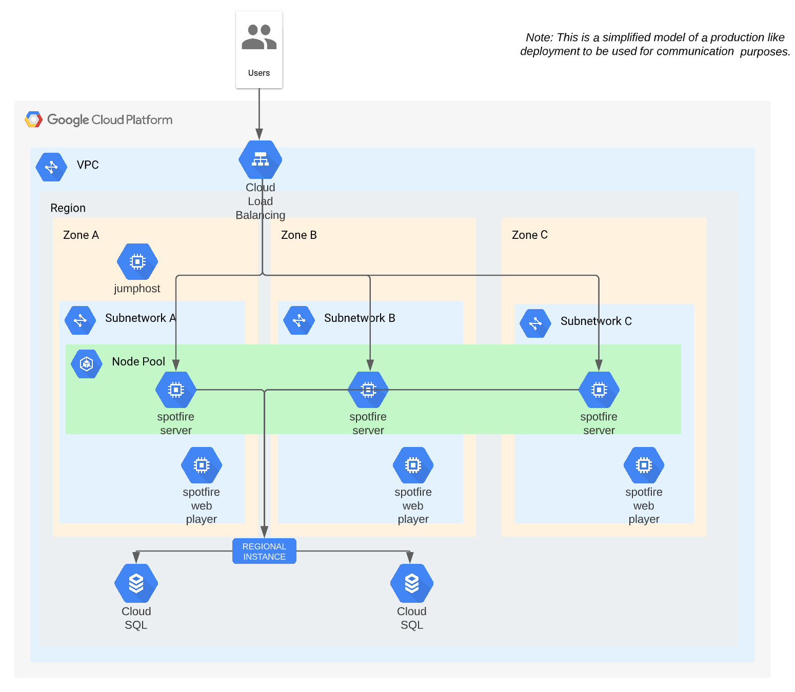

# Spotfire Quickstart on Google Compute Engine

## Overview

This **Spotfire QuickStart on Google Compute Engine** shows 
how to automatically deploy the [Spotfire platform](https://www.spotfire.com/) 
on [Google Cloud Compute Engine](https://cloud.google.com/compute).

**Note**: This quickstart provides a starting point for automatic deployment of Spotfire using different common configuration management tools.
This quickstart is not for production usage.
This quickstart example can be easily extended and customized for production usage.

**Note**: This quickstart has been validated with Spotfire 14.0 series. 
It might work for other Spotfire versions with some modifications.

### Which kind of Spotfire deployment is deployed by this quickstart example?

This quickstart has 2 main parts:

1. Create the required infrastructure components using [Terraform](https://www.terraform.io/) templates:
   - Network: Google Virtual Private Cloud (VPC).
   - Jump-host VMs: Google Compute Engine instances.
   - Spotfire VMs: Google Compute Engine instances.
   - Spotfire database: GCP SQL for PostgreSQL.
   - Load balancer: Google Cloud Load Balancing.

2. Deploy the Spotfire environment using [Ansible](https://github.com/ansible/ansible) playbooks.

   **Note**: The included playbooks follow the [Basic installation process for Spotfire](https://docs.tibco.com/pub/spotfire_server/latest/doc/html/TIB_sfire_server_tsas_admin_help/server/topics/basic_installation_process_for_spotfire.html)
   from the [Spotfire® Server and Environment - Installation and Administration](https://docs.tibco.com/pub/spotfire_server/latest/doc/html/TIB_sfire_server_tsas_admin_help/server/topics/basic_installation_process_for_spotfire.html).

**Note**: This deployment has been verified with Google Compute Engine instances with Debian 12.

The diagram shows the deployed environment by this _Spotfire Quickstart on Google Compute Engine_:



## Prerequisites

- Required **Spotfire** installation packages. You can download them from the [Spotfire Download site](https://www.spotfire.com/downloads):
    - Spotfire Server: Linux tar.gz package:
        - `spotfireserver-<version>.x86_64.tar.gz`
    - Spotfire node manager: Linux tar.gz package:
        - `spotfirenodemanager-<version>.x86_64.tar.gz`
    - Spotfire distribution files (the distribution files can contain packages for clients, services or customizations):
        - `Spotfire.Dxp.sdn`
        - `Spotfire.Dxp.netcore-linux.sdn`
- A **Linux host** with admin permissions to install and use the required tools.
  You can use a bare metal installed server, a virtual machine, or WSL on Windows.
  In this quickstart we will refer to it as "_the launcher_".
- A valid **GCP account and access credentials**.

**Note**: All the examples and scripts in this quickstart use a Debian/Ubuntu host as the launcher.
If you want to use any other Linux distro as your launcher, 
see the corresponding vendor instructions and adapt this quickstart as required.

## Launcher setup

1. Clone this repo into a folder in your launcher host:
    ```bash
    git clone https://github.com/spotfiresoftware/spotfire-quickstart
    ```

2. Download the Spotfire software and copy the files into `<this_repo_root>/swrepo/build/<spotfire_version>`.

    **Note**: See the [Spotfire software repository](../../swrepo/build/README.md) for more information.

3. Install the required configuration management applications.
 
   Follow the [Install the Configuration Management applications](docs/Setup.md) instructions
   to manually install and configure GCP, Terraform and Ansible clients in your launcher.

   For your convenience, there is a `Makefile` that enables you to use `terraform` and `ansible` commands via the `make` command from the Terraform templates folder (`<this_repo_root>/terraform/gcp`).
   This way, you do not need to memorize the syntax, and the commands are much simpler.

   **Note**: If you want to know about the details and understand what is going under the hood,
   you can check the [Detailed instructions](docs/Detailed-instructions.md).

4. Generate SSH keys (if you do not have them already):
    ```bash
    ssh-keygen -t rsa -C "spotfire-deploy-gcp" -f ~/.ssh/id_rsa_gcp -N ""
    ```

## Usage

The deployment life cycle consists of these main steps:

- Install requirements
- Configure your cloud account and the target infrastructure sizing
- Create the required infrastructure (with Terraform)
- Deploy the Spotfire software (with Ansible)
- Resize or reconfigure the created environment
- Destroy the created environment

### Install requirements

First, you need to install `terraform`, `ansible` and the GCP CLI in your launcher.
 
For a quick reference, see [Install the applications](docs/Setup.md).

### Configure your cloud account and the target infrastructure sizing

**Note**: The specific method to access your cloud account and roles might change depending on your company policy. 
Make sure you understand how identity management works in Google Cloud.
The steps below are an example: 

1. If not already done, sign in into GCP with the GCP CLI:
    ```bash
    make gcp-login
    ```
   **Note**: This make command wraps a call to `gcloud auth application-default login`.
   For more details or other authentication methods, see [Google Cloud Authentication methods](https://cloud.google.com/container-registry/docs/advanced-authentication).

2. List the service accounts and note the email of the service account you want to use:
    ```bash
    gcloud iam service-accounts list
    ```
   Create and download a private key for the selected service account:
    ```bash
    gcloud iam service-accounts keys create sa-private-key.json  --iam-account=144430001824-compute@developer.gserviceaccount.com
    ```

    Note: If you do not have a service account yet, create one with the required permissions. For more details, see the [GCP IAM service accounts documentation](https://docs.cloud.google.com/iam/docs/service-accounts-create).

### Configure the target environment

1. You can customize the **deployment environment** by editing the file `terraform.env`.

   **Note**: You need to use a different `TF_WORKSPACE` for applying different environments for the same location.

2. You can customize the **infrastructure settings** like number of instances or sizing, by modifying the `terraform.env`, `variables.tfvars` and `vars-size-XS.tfvars`.
   Open the files for listing the existing configuration variables, description and documentation links.

   **Note**: Using a different `prefix` string in the `variables.tfvars` per environment, you can create multiple environments using the same account.

   **Note**: You need to modify the `admin_address_prefixes` and `web_address_prefixes` variables,
   so you allow infra admin and end user access to the environment from your respective selected IP address blocks
   (you can find your public ip address for example in https://whatismyipaddress.com/).

   **Note**: The `vars-size-XS.tfvars` settings overrides `variables.tfvars` settings.

3. If you want to change the **Spotfire application settings** (like the Spotfire version, config-tool and web admin credentials,...), review and edit the file `ansible/config/vars.yml`.

   **Note**: The variables in `ansible/config/vars.yml` are used as defaults and may be overriden by previous configuration files.

### Create the required infrastructure (using Terraform)

1. Initiate your environment (it installs and upgrades all required Terraform modules):
    ```bash
    make init
    ```

2. Verify the planed infrastructure changes before applying them:
    ```bash
    make plan
    ```

3. If you agree with the planned changes, apply them to create the infrastructure:
    ```bash
    make apply
    ```
   **Note**: This step can take 5-15 minutes depending on the sizing and the cloud service provider resources.

### Deploy the Spotfire software (using Ansible)

4. Once the infrastructure is in place, you can deploy the Spotfire software:
    ```bash
    make deploy
    ```
   **Note**: This step can take 10-20 minutes depending on the sizing and the cloud service provider resources.

### Resize or reconfigure the created environment

5. You can resize or change your system's configuration by editing again the named configuration files and repeating steps 4-8_:
    ```bash
    make plan
    make apply
    make deploy
    ```

    **Note**: You can use a similar `deploy` command as above to limit the deployment to a specific type of server.
    For example if you only increased the number of VM instances for the Spotfire Web Player servers you can just deploy those with:
    ```bash
    make deploy ANSIBLE_EXTRA_ARGS="--limit sfwp_servers"
    ```
    For more details on how to limit and filter the Ansible playbook execution, see the [Ansible documentation](https://docs.ansible.com/).

### Use your environment

6. You can find details for the created environment using:
    ```bash
    make show-hosts
    make show-lb
    ```

   There are more `show-*` command aliases preconfigured to retrieve basic information on your created environment.
   Run `make` without arguments to see the `Makefile` operations help.

7. Open the Spotfire server web UI, accessible via the Google Cloud Load Balancer address: `http://<your-gcp-lb-ip-address>`.

   **Note**: The Spotfire server and services can take 1-5 minutes to bootstrap and be ready.

### Destroy the created environment

8. Remember to destroy the environment when you are not going to use it to avoid unneeded costs:
    ```bash
    make destroy
    ```

   **Note**: You may need to execute this command a couple of times to destroy all the resources.
   This happens sometimes if the resources are being accessed or due resources dependency resolution.

## What to do next

There are further ways to customize this quickstart:

- Enable SSL connections
- Add other Spotfire services (e.g. Python service, TERR service, R service, Automations Services)
- Add external user authorization and authentication
- Add a Spotfire action log database
- Add Google Object storage for the Spotfire library items storage
- Use multiple regions
- etc.

Please, see the [Spotfire® Server and Environment - Installation and Administration](https://docs.tibco.com/pub/spotfire_server/latest/doc/html/TIB_sfire_server_tsas_admin_help/server/topics/basic_installation_process_for_spotfire.html) documentation for details on specific administration procedures.
